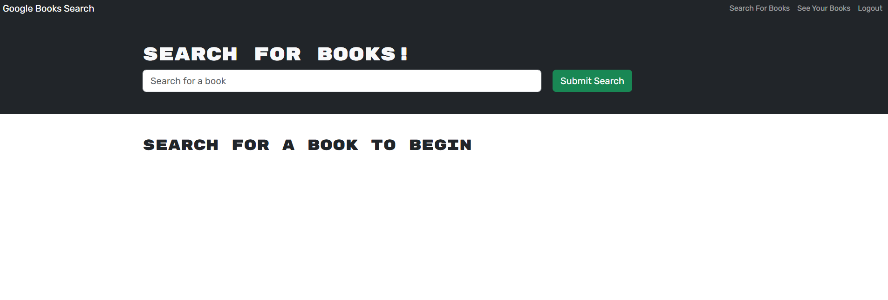

# 18 MERN: Book Search Engine

# Book Search Engine

## Table of Contents
- [Description](#description)
- [Features](#features)
- [Technologies Used](#technologies-used)
- [Installation](#installation)
- [Usage](#usage)
- [Screenshots](#screenshots)
- [Deployment](#deployment)
- [Contact](#contact)

---

## Description
The **Book Search Engine** is a web application that allows users to search for books, create an account, and save their favorite books. The app integrates with the **Google Books API** to fetch book details and uses a secure authentication system for user accounts. Users can search for books without logging in but need to sign up to save books to their account.

---

## Features

### 🔍 Book Search
- Users can search for books using a search bar.
- Results display the book **title, author, description, image**, and a **link to the book** on Google Books.
- Books can be saved to a user’s account when logged in.

### 🔑 User Authentication
- Users can **sign up** with a **username, email, and password**.
- Existing users can **log in** with their credentials.
- Authentication is handled securely with **JSON Web Tokens (JWT)**.
- Logged-in users can access additional features such as saving books.
- Users can log out, which clears their session.

### 📚 Saved Books
- Logged-in users can save books to their account.
- Users can view their saved books list, which includes book details.
- Books can be removed from the saved list at any time.

---

## Technologies Used
- **React.js** – Frontend framework
- **Node.js & Express.js** – Backend API
- **MongoDB & Mongoose** – Database for storing user data and saved books
- **GraphQL & Apollo Client** – Managing API requests
- **JSON Web Tokens (JWT)** – Secure authentication
- **Google Books API** – Fetching book details
- **Bootstrap / Tailwind CSS** – Styling and UI components

---

## Installation
To run the project locally, follow these steps:

1. **Clone the Repository:**
   ```sh
   git clone https://github.com/DavidSwider/BookEngine.git
   cd book-search-engine
   ```  
2. **Install Dependencies:**
   ```sh
   npm install
   ```  
3. **Start the Backend Server:**
   ```sh
   npm run build
   ```  
4. **Start the Frontend:**
   ```sh
   npm run start
   ```  
5. Open `http://localhost:3000/` in your browser.

---

## Usage

1. **Search for Books** using the search bar on the homepage.
2. Click **Login/Signup** to create an account or log in.
3. Once logged in, the menu updates to include **Saved Books and Logout**.
4. Search results will display a **Save button** for each book.
5. Click **Save** to add a book to your saved books list.
6. Visit **Saved Books** to view your saved list and remove books if needed.
7. Click **Logout** to end your session.

---

## Screenshots
📸 **

---

## Deployment
The application is deployed at:
🔗 **[Live Application](https://bookengine-ap4q.onrender.com)**

---

## Contact
📧 Email: Davdiswider6@gmail.com  
🔗 GitHub: [YourGitHubProfile](https://github.com/DavidSwider/BookEngine)  

---

This README provides a structured overview of the **Book Search Engine**.🚀

